# Garden-API
## Description
This is an API that uses Spring Boot, JUnit, Lombok, Mockito, MySQL, Swagger and JBDC to retrieve information about the state of a garden
and give commands to water it or perform other Functions

### Logic
The Spring boot app starts by defining a model of the object that we will be storing in the Database. 

It then uses a repository object to interface with our Database and perform CRUD operations. Calls to the repo class happen from the functions defined in the Service class and those functions are called from our Controller class by Mapping each call to a web request.

The JUnit tests cover 85% of the code and use Mockito to create temporary repos and service classes to isolate each Unit test.

Swagger is also installed to provide a nice front end for anyone looking to get familiar with the API.

## TODO
- Add DTOs
- Rework the Services so that it can be useful to an actual garden
- Add models for Air and Soil temperature and humidity
- Potentially turn it into a Home Assitant addon to be used with my [Garduino](https://github.com/StathisKap/Garduino) project

# Risk Assessment

- Considering we are using a SQL database, and receiving data from the user, we should always cleanse their input before using it, otherwise we might be susceptible to an SQL Injection.
- Another Possible security risk would be if we used HTTP rather than HTTPS in production.
- Many dependencies on the pom file have their versions hard coded, meaning that they won’t be updated unless that version number is manually changed.
- We are accessing the DB as the root password, meaning that if we have any other DBs in our MySQL, then someone could access them. Root also uses no password, which is even more of a security threat.
- Another security thread would be a DOS attack. Since we are not managing the number of requests we are handling any one time, an attacker could easily just overwhelm our application to the point of failure.
- Lack of TLS can leave the API vulnerable to Man In The Middle attacks.

# Screenshots

### Test Coverage
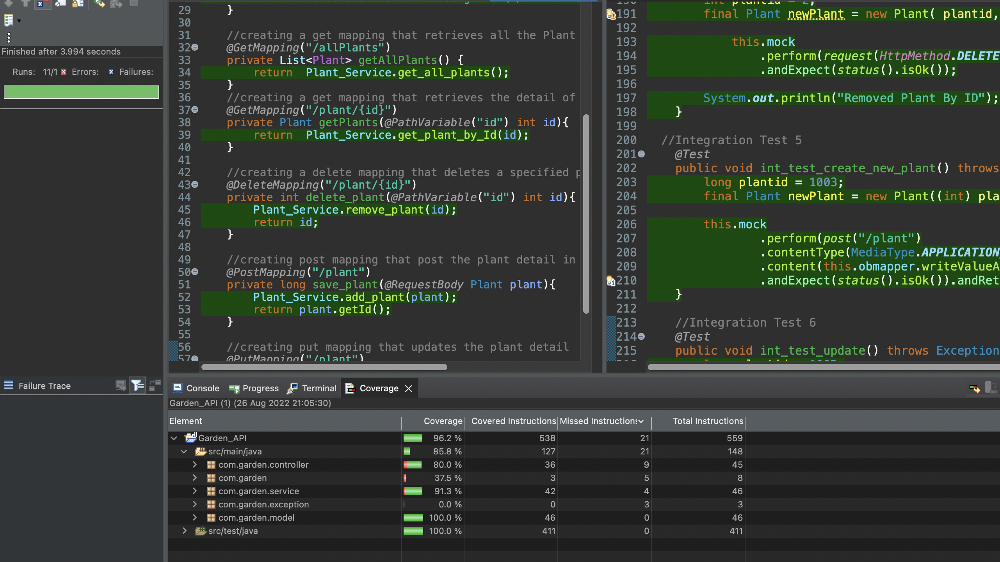

### Swagger
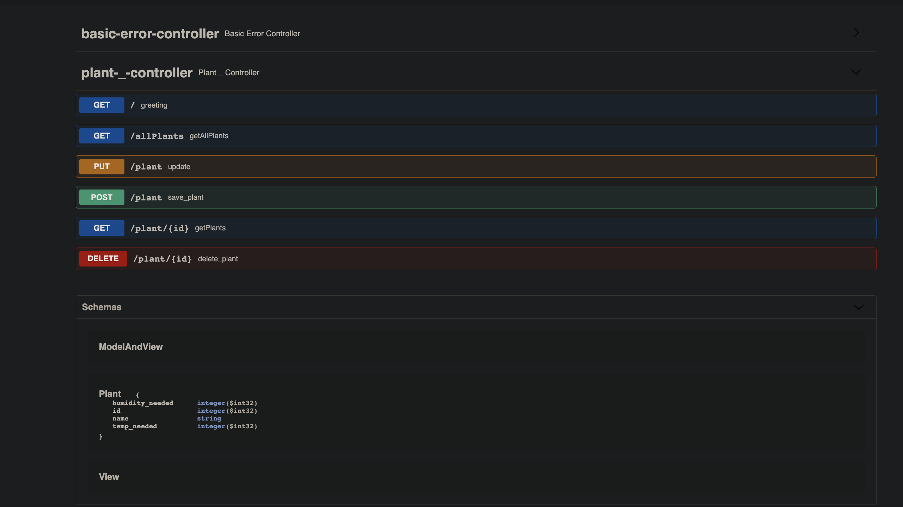

### PostMan

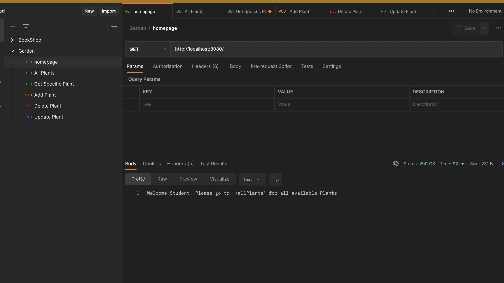
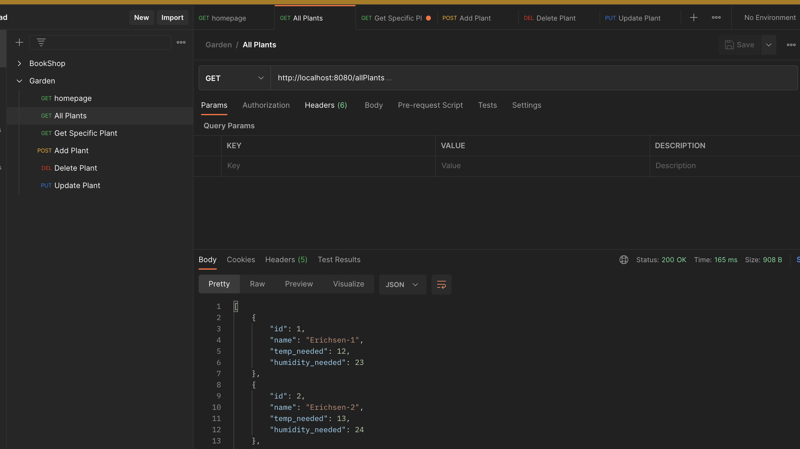
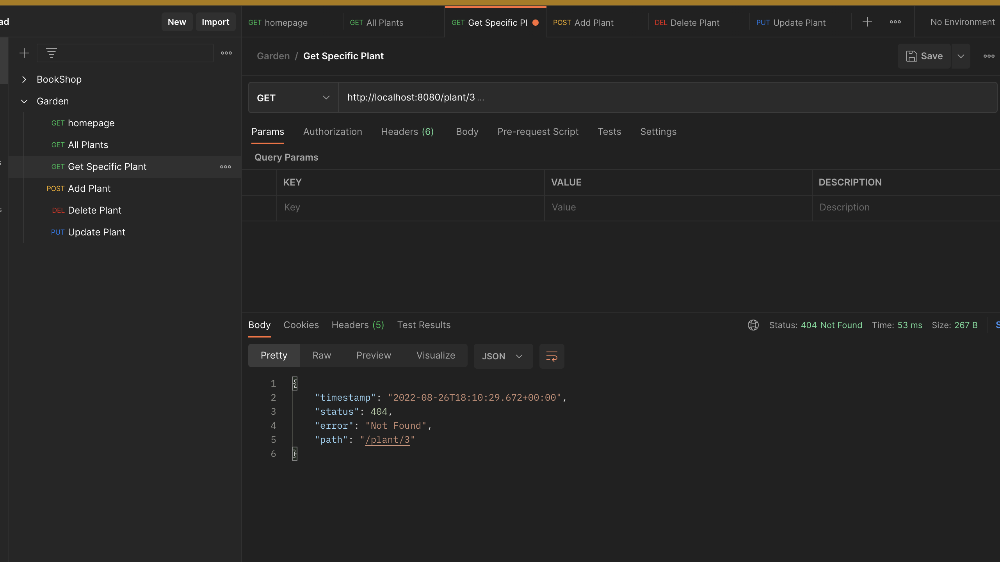
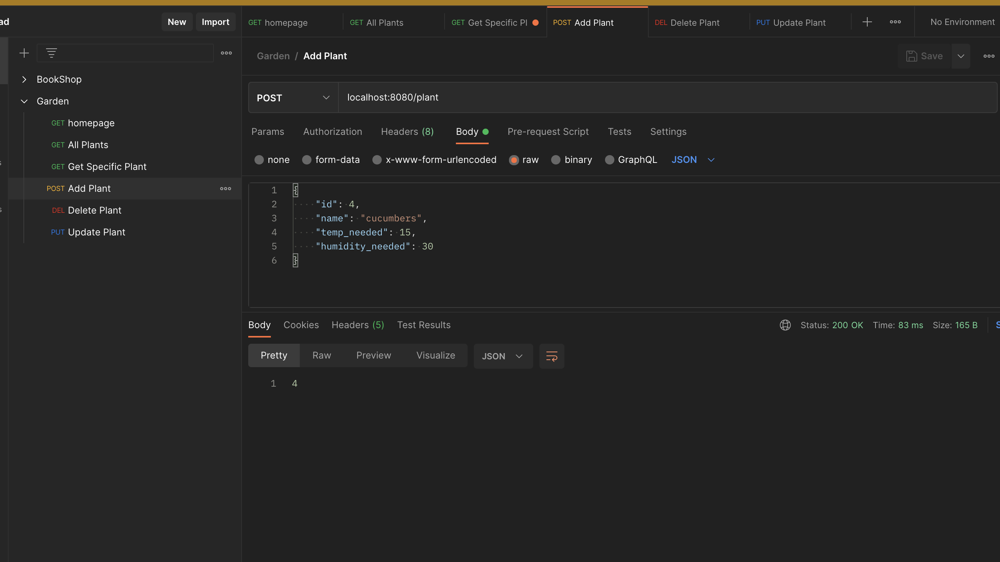
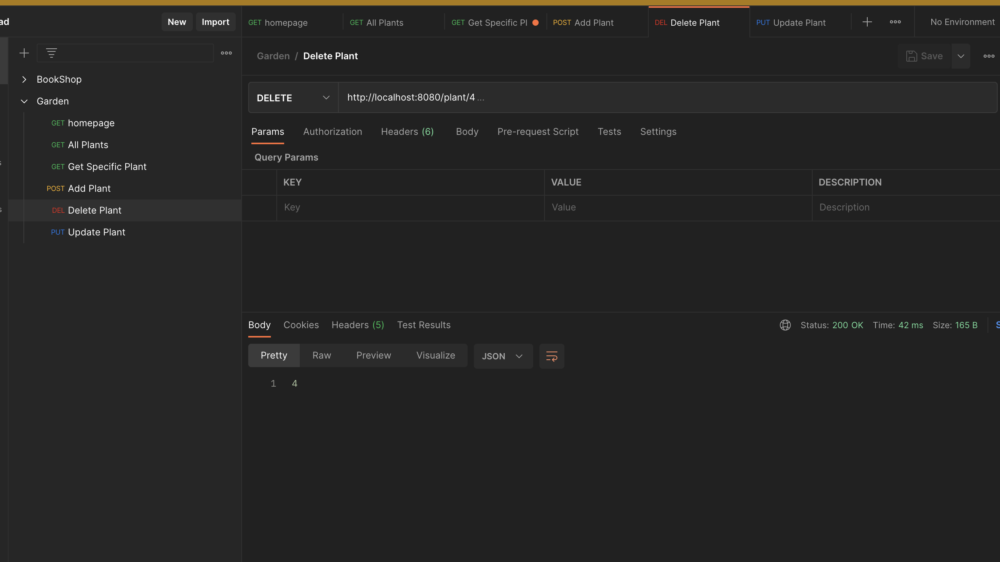
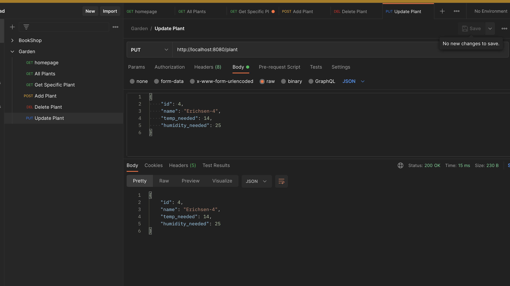

### Jira

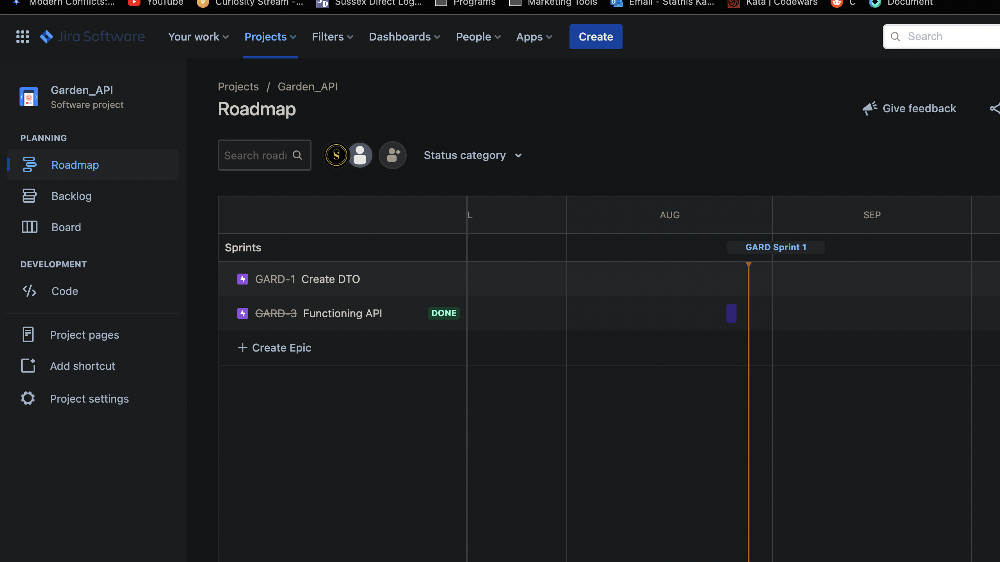
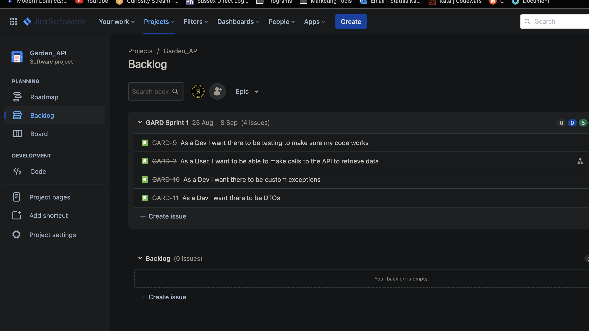
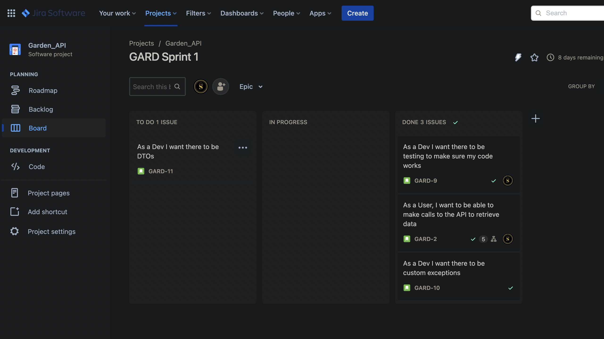
